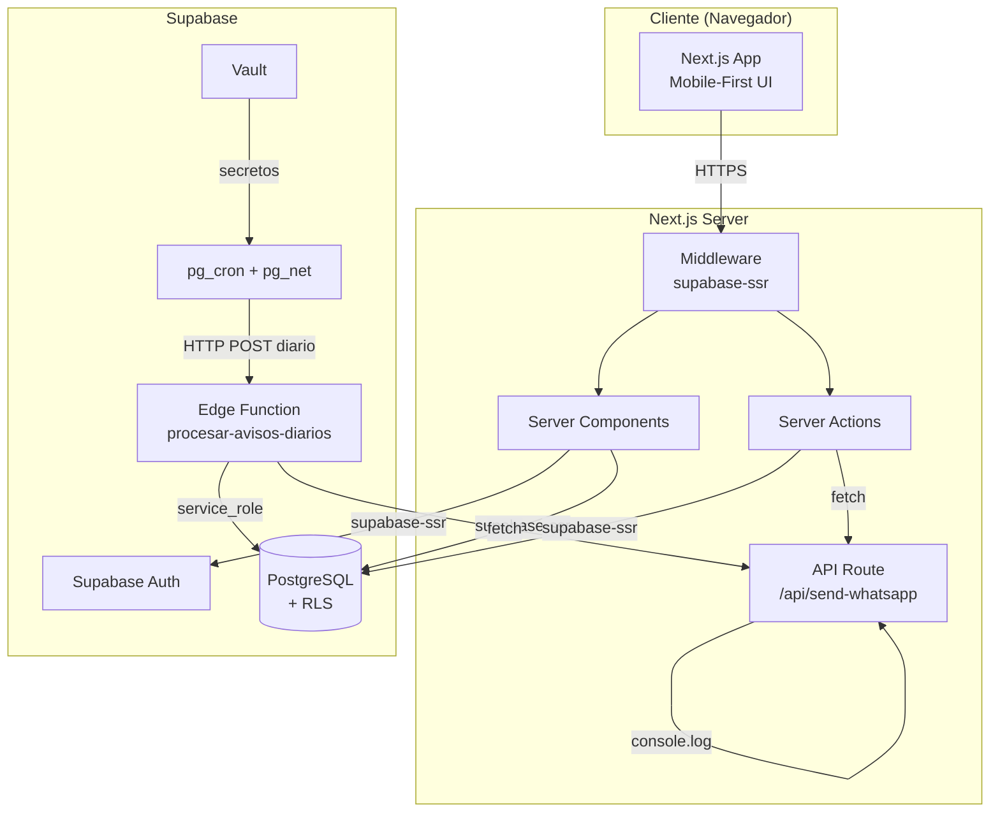
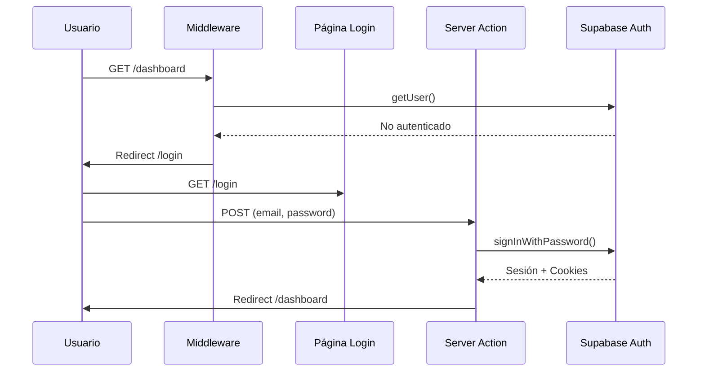
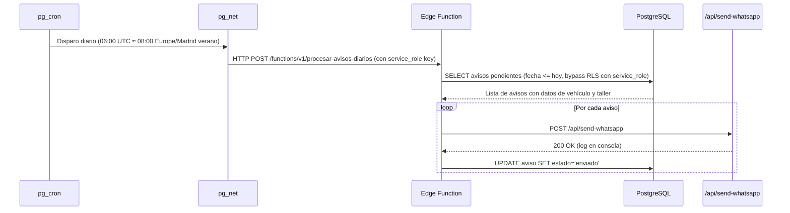
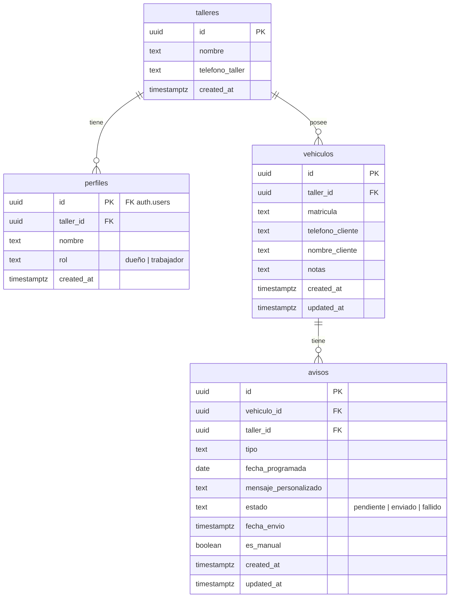

# Documento de Diseño - AutoAvisa MVP

## Visión General

AutoAvisa es un SaaS multi-tenant para talleres de reparación de automóviles. El sistema permite a los talleres registrar vehículos de clientes, programar avisos de mantenimiento y enviar recordatorios automáticos por WhatsApp (modo dummy en MVP).

### Stack Tecnológico

- **Frontend**: Next.js 14+ con App Router, Tailwind CSS (mobile-first), Lucide React
- **Backend**: Supabase (Auth, Database PostgreSQL, Edge Functions)
- **Autenticación**: supabase-ssr con cookies
- **Cron**: pg_cron + pg_net invocando Edge Function diariamente
- **WhatsApp**: API dummy (console.log), preparada para Twilio

### Decisiones de Diseño Clave

| Decisión | Justificación |
|---|---|
| Multi-tenant con RLS | Aislamiento de datos sin complejidad de múltiples bases de datos |
| pg_cron + pg_net + Edge Function | Patrón nativo de Supabase para cron: pg_cron programa, pg_net invoca la Edge Function vía HTTP |
| supabase-ssr con middleware | Manejo seguro de sesiones server-side en Next.js App Router |
| Sin registro público | El admin crea cuentas manualmente vía scripts SQL documentados |
| Máximo 3 usuarios por taller | Restricción enforced a nivel de base de datos con trigger |
| Vault para secretos del cron | Las credenciales de la Edge Function (service_role key) se almacenan en Supabase Vault |

## Arquitectura

### Diagrama de Arquitectura General



### Flujo de Autenticación



### Flujo del Cron Diario



## Componentes e Interfaces

### Estructura de Carpetas del Proyecto

```
autoavisa-mvp/
├── .env.local.example
├── middleware.ts
├── next.config.ts
├── tailwind.config.ts
├── package.json
├── lib/
│   └── supabase/
│       ├── client.ts          # Cliente Supabase para Client Components
│       ├── server.ts          # Cliente Supabase para Server Components/Actions
│       └── middleware.ts       # Lógica de actualización de sesión
├── types/
│   └── database.ts            # Tipos generados por Supabase CLI
├── app/
│   ├── layout.tsx             # Layout raíz con providers
│   ├── globals.css            # Estilos globales Tailwind
│   ├── login/
│   │   ├── page.tsx           # Página de login (solo login, sin registro)
│   │   └── actions.ts         # Server Action: signInWithPassword
│   ├── (protected)/
│   │   ├── layout.tsx         # Layout protegido (verifica sesión)
│   │   ├── dashboard/
│   │   │   └── page.tsx       # Dashboard principal del taller
│   │   └── vehiculos/
│   │       ├── nuevo/
│   │       │   └── page.tsx   # Formulario añadir vehículo
│   │       └── [id]/
│   │           ├── page.tsx   # Ficha detallada del vehículo
│   │           ├── avisos/
│   │           │   └── nuevo/
│   │           │       └── page.tsx  # Formulario nuevo aviso
│   │           └── enviar-aviso/
│   │               └── page.tsx      # Envío manual de aviso
│   └── api/
│       └── send-whatsapp/
│           └── route.ts       # API dummy WhatsApp
├── components/
│   ├── ui/
│   │   ├── toast.tsx          # Componente toast reutilizable
│   │   ├── boton.tsx          # Botón con estilos táctiles
│   │   ├── campo-texto.tsx    # Input con label y validación
│   │   └── tarjeta.tsx        # Tarjeta reutilizable
│   ├── vehiculo-card.tsx      # Tarjeta de vehículo para el dashboard
│   ├── aviso-card.tsx         # Tarjeta de aviso individual
│   ├── buscador-matricula.tsx # Campo de búsqueda por matrícula
│   ├── selector-tipo-aviso.tsx # Selector de tipo de mantenimiento
│   └── historial-avisos.tsx   # Lista de historial de avisos
├── supabase/
│   ├── migrations/
│   │   └── 001_schema_inicial.sql
│   ├── functions/
│   │   └── procesar-avisos-diarios/
│   │       └── index.ts       # Edge Function del cron
│   └── scripts/
│       ├── crear-taller.sql   # Script para crear taller + usuario
│       └── añadir-trabajador.sql # Script para añadir trabajador
└── docs/
    └── admin-scripts.md       # Documentación de scripts admin en español
```

### Componentes React Principales

#### Página de Login (`app/login/page.tsx`)
- Server Component con formulario
- Campos: email, contraseña
- Sin opción de registro
- Mensajes de error en español genéricos (no revelan si el email existe)

#### Layout Protegido (`app/(protected)/layout.tsx`)
- Verifica sesión con `supabase.auth.getUser()`
- Redirige a `/login` si no autenticado
- Carga el perfil del usuario (taller_id, rol)
- Provee contexto del taller a componentes hijos

#### Dashboard (`app/(protected)/dashboard/page.tsx`)
- Sección "Avisos Próximos" (próximos 7 días)
- Sección "Todos los Vehículos" con tarjetas
- Buscador por matrícula en la parte superior
- Filtrado en tiempo real (client-side)

#### Ficha de Vehículo (`app/(protected)/vehiculos/[id]/page.tsx`)
- Datos del vehículo (matrícula, teléfono, nombre, notas)
- Lista de avisos programados ordenados por fecha
- Avisos próximos (7 días) destacados visualmente
- Botón "Enviar Aviso 🔔" para envío manual
- Sección "Historial de Avisos"
- Botón para añadir nuevo aviso

### API Route: WhatsApp Dummy (`app/api/send-whatsapp/route.ts`)

```typescript
// Interfaz de la API
interface SendWhatsAppRequest {
  telefono: string;
  nombre_cliente: string;
  nombre_taller: string;
  tipo_mantenimiento: string;
  mensaje: string;
  matricula: string;
}

interface SendWhatsAppResponse {
  estado: 'enviado';
  timestamp: string;
}
```

**Comportamiento:**
- Acepta POST con datos del aviso
- Genera mensaje en español con emojis según tipo de mantenimiento
- Registra log en consola con formato: `[WHATSAPP LOG] 🚗 Taller: {nombre} | Para: {cliente} ({tel}) | Aviso: {tipo} | Mensaje: {contenido}`
- Retorna HTTP 200 con `{ estado: 'enviado' }`
- Estructura modular: la función de envío está aislada para futura integración con Twilio

### Mapa de Emojis por Tipo de Mantenimiento

| Tipo | Emoji |
|---|---|
| ITV | 🚗 |
| Cambio de aceite | 🛢️ |
| Filtros | 🔧 |
| Revisión general | 🛠️ |
| Neumáticos | 🔘 |
| Otro | 🔔 |

### Edge Function: `procesar-avisos-diarios`

```typescript
// Pseudocódigo de la Edge Function
// Se ejecuta vía pg_cron + pg_net diariamente

import "jsr:@supabase/functions-js/edge-runtime.d.ts";
import { createClient } from "jsr:@supabase/supabase-js@2";

Deno.serve(async (req: Request) => {
  // 1. Crear cliente Supabase con service_role (acceso completo, bypass RLS)
  //    - La service_role key se obtiene de las variables de entorno de la Edge Function
  //    - Esto permite leer avisos de TODOS los talleres sin restricciones RLS
  // 2. Consultar avisos: estado='pendiente' AND fecha_programada <= hoy (Europe/Madrid)
  // 3. Para cada aviso:
  //    a. Obtener datos del vehículo y taller
  //    b. POST a /api/send-whatsapp
  //    c. Si éxito: UPDATE aviso SET estado='enviado', fecha_envio=now()
  //    d. Si fallo: mantener estado='pendiente', log del error
  // 4. Retornar resumen de procesamiento
});
```

### Middleware de Autenticación (`middleware.ts`)

Basado en el patrón oficial de supabase-ssr:
- Intercepta todas las rutas excepto estáticas y assets
- Refresca tokens expirados con `supabase.auth.getUser()`
- Pasa cookies actualizadas al response

## Modelos de Datos

### Diagrama Entidad-Relación



### Esquema SQL Detallado

#### Tabla `talleres`
```sql
-- Tabla principal de talleres (tenants)
CREATE TABLE public.talleres (
  id UUID PRIMARY KEY DEFAULT gen_random_uuid(),
  nombre TEXT NOT NULL,
  telefono_taller TEXT,
  created_at TIMESTAMPTZ NOT NULL DEFAULT now()
);

-- RLS habilitado
ALTER TABLE public.talleres ENABLE ROW LEVEL SECURITY;
```

#### Tabla `perfiles`
```sql
-- Perfiles de usuarios asociados a un taller
-- Máximo 3 por taller (enforced por trigger)
CREATE TABLE public.perfiles (
  id UUID PRIMARY KEY REFERENCES auth.users(id) ON DELETE CASCADE,
  taller_id UUID NOT NULL REFERENCES public.talleres(id) ON DELETE CASCADE,
  nombre TEXT NOT NULL,
  rol TEXT NOT NULL CHECK (rol IN ('dueño', 'trabajador')),
  created_at TIMESTAMPTZ NOT NULL DEFAULT now()
);

-- RLS habilitado
ALTER TABLE public.perfiles ENABLE ROW LEVEL SECURITY;

-- Índice para búsquedas por taller
CREATE INDEX idx_perfiles_taller_id ON public.perfiles(taller_id);
```

#### Tabla `vehiculos`
```sql
-- Vehículos registrados por cada taller
CREATE TABLE public.vehiculos (
  id UUID PRIMARY KEY DEFAULT gen_random_uuid(),
  taller_id UUID NOT NULL REFERENCES public.talleres(id) ON DELETE CASCADE,
  matricula TEXT NOT NULL,
  telefono_cliente TEXT NOT NULL,
  nombre_cliente TEXT,
  notas TEXT,
  created_at TIMESTAMPTZ NOT NULL DEFAULT now(),
  updated_at TIMESTAMPTZ NOT NULL DEFAULT now(),

  -- Matrícula única por taller
  CONSTRAINT uq_vehiculo_matricula_taller UNIQUE (taller_id, matricula)
);

-- RLS habilitado
ALTER TABLE public.vehiculos ENABLE ROW LEVEL SECURITY;

-- Índices
CREATE INDEX idx_vehiculos_taller_id ON public.vehiculos(taller_id);
CREATE INDEX idx_vehiculos_matricula ON public.vehiculos(taller_id, matricula);
```

#### Tabla `avisos`
```sql
-- Avisos de mantenimiento programados
CREATE TABLE public.avisos (
  id UUID PRIMARY KEY DEFAULT gen_random_uuid(),
  vehiculo_id UUID NOT NULL REFERENCES public.vehiculos(id) ON DELETE CASCADE,
  taller_id UUID NOT NULL REFERENCES public.talleres(id) ON DELETE CASCADE,
  tipo TEXT NOT NULL CHECK (tipo IN ('itv', 'aceite', 'filtros', 'revision', 'neumaticos', 'otro')),
  fecha_programada DATE NOT NULL,
  mensaje_personalizado TEXT,
  estado TEXT NOT NULL DEFAULT 'pendiente' CHECK (estado IN ('pendiente', 'enviado', 'fallido')),
  fecha_envio TIMESTAMPTZ,
  es_manual BOOLEAN NOT NULL DEFAULT false,
  created_at TIMESTAMPTZ NOT NULL DEFAULT now(),
  updated_at TIMESTAMPTZ NOT NULL DEFAULT now()
);

-- RLS habilitado
ALTER TABLE public.avisos ENABLE ROW LEVEL SECURITY;

-- Índices
CREATE INDEX idx_avisos_taller_id ON public.avisos(taller_id);
CREATE INDEX idx_avisos_vehiculo_id ON public.avisos(vehiculo_id);
-- Índice para el cron: buscar avisos pendientes por fecha
CREATE INDEX idx_avisos_pendientes ON public.avisos(fecha_programada, estado)
  WHERE estado = 'pendiente';
-- Índice para ordenar avisos por fecha en la ficha del vehículo
CREATE INDEX idx_avisos_vehiculo_fecha ON public.avisos(vehiculo_id, fecha_programada);
```

### Función Auxiliar: Obtener taller_id del Usuario Autenticado

```sql
-- Función helper para obtener el taller_id del usuario autenticado
-- Usada en todas las políticas RLS
CREATE OR REPLACE FUNCTION public.get_mi_taller_id()
RETURNS UUID
LANGUAGE sql
STABLE
SECURITY DEFINER
SET search_path = ''
AS $$
  SELECT taller_id
  FROM public.perfiles
  WHERE id = (SELECT auth.uid())
$$;
```

### Políticas RLS

#### Tabla `talleres`
```sql
-- Los usuarios solo pueden ver su propio taller
CREATE POLICY "Usuarios ven su propio taller"
  ON public.talleres FOR SELECT
  USING (id = public.get_mi_taller_id());
```

#### Tabla `perfiles`
```sql
-- Los usuarios solo pueden ver perfiles de su taller
CREATE POLICY "Usuarios ven perfiles de su taller"
  ON public.perfiles FOR SELECT
  USING (taller_id = public.get_mi_taller_id());
```

#### Tabla `vehiculos`
```sql
-- SELECT: solo vehículos de su taller
CREATE POLICY "Usuarios ven vehículos de su taller"
  ON public.vehiculos FOR SELECT
  USING (taller_id = public.get_mi_taller_id());

-- INSERT: solo pueden insertar en su taller
CREATE POLICY "Usuarios crean vehículos en su taller"
  ON public.vehiculos FOR INSERT
  WITH CHECK (taller_id = public.get_mi_taller_id());

-- UPDATE: solo pueden actualizar vehículos de su taller
CREATE POLICY "Usuarios actualizan vehículos de su taller"
  ON public.vehiculos FOR UPDATE
  USING (taller_id = public.get_mi_taller_id())
  WITH CHECK (taller_id = public.get_mi_taller_id());

-- DELETE: solo pueden eliminar vehículos de su taller
CREATE POLICY "Usuarios eliminan vehículos de su taller"
  ON public.vehiculos FOR DELETE
  USING (taller_id = public.get_mi_taller_id());
```

#### Tabla `avisos`
```sql
-- SELECT: solo avisos de su taller
CREATE POLICY "Usuarios ven avisos de su taller"
  ON public.avisos FOR SELECT
  USING (taller_id = public.get_mi_taller_id());

-- INSERT: solo pueden insertar avisos en su taller
CREATE POLICY "Usuarios crean avisos en su taller"
  ON public.avisos FOR INSERT
  WITH CHECK (taller_id = public.get_mi_taller_id());

-- UPDATE: solo pueden actualizar avisos de su taller
CREATE POLICY "Usuarios actualizan avisos de su taller"
  ON public.avisos FOR UPDATE
  USING (taller_id = public.get_mi_taller_id())
  WITH CHECK (taller_id = public.get_mi_taller_id());

-- DELETE: solo pueden eliminar avisos de su taller
CREATE POLICY "Usuarios eliminan avisos de su taller"
  ON public.avisos FOR DELETE
  USING (taller_id = public.get_mi_taller_id());
```

### Triggers y Funciones de Base de Datos

#### Trigger: Limitar 3 perfiles por taller
```sql
-- Función que verifica el límite de 3 perfiles por taller
CREATE OR REPLACE FUNCTION public.verificar_limite_perfiles()
RETURNS TRIGGER
LANGUAGE plpgsql
SECURITY DEFINER
SET search_path = ''
AS $$
DECLARE
  conteo INTEGER;
BEGIN
  SELECT COUNT(*) INTO conteo
  FROM public.perfiles
  WHERE taller_id = NEW.taller_id;

  IF conteo >= 3 THEN
    RAISE EXCEPTION 'El taller ya tiene el máximo de 3 usuarios permitidos';
  END IF;

  RETURN NEW;
END;
$$;

CREATE TRIGGER trigger_limite_perfiles
  BEFORE INSERT ON public.perfiles
  FOR EACH ROW
  EXECUTE FUNCTION public.verificar_limite_perfiles();
```

#### Trigger: Actualizar `updated_at` automáticamente
```sql
-- Función genérica para actualizar updated_at
CREATE OR REPLACE FUNCTION public.actualizar_updated_at()
RETURNS TRIGGER
LANGUAGE plpgsql
AS $$
BEGIN
  NEW.updated_at = now();
  RETURN NEW;
END;
$$;

-- Trigger para vehiculos
CREATE TRIGGER trigger_vehiculos_updated_at
  BEFORE UPDATE ON public.vehiculos
  FOR EACH ROW
  EXECUTE FUNCTION public.actualizar_updated_at();

-- Trigger para avisos
CREATE TRIGGER trigger_avisos_updated_at
  BEFORE UPDATE ON public.avisos
  FOR EACH ROW
  EXECUTE FUNCTION public.actualizar_updated_at();
```

#### Trigger: Asignar taller_id automáticamente en avisos
```sql
-- Al insertar un aviso, copiar el taller_id del vehículo
CREATE OR REPLACE FUNCTION public.asignar_taller_aviso()
RETURNS TRIGGER
LANGUAGE plpgsql
SECURITY DEFINER
SET search_path = ''
AS $$
BEGIN
  SELECT taller_id INTO NEW.taller_id
  FROM public.vehiculos
  WHERE id = NEW.vehiculo_id;

  IF NEW.taller_id IS NULL THEN
    RAISE EXCEPTION 'Vehículo no encontrado';
  END IF;

  RETURN NEW;
END;
$$;

CREATE TRIGGER trigger_asignar_taller_aviso
  BEFORE INSERT ON public.avisos
  FOR EACH ROW
  EXECUTE FUNCTION public.asignar_taller_aviso();
```

> **Nota sobre orden de ejecución PostgreSQL y RLS:** El trigger `trigger_asignar_taller_aviso` es de tipo `BEFORE INSERT`, lo que significa que se ejecuta **antes** de que PostgreSQL evalúe las políticas RLS `WITH CHECK`. El orden de ejecución es: (1) el trigger `BEFORE INSERT` se dispara y asigna `taller_id` copiándolo del vehículo, (2) PostgreSQL evalúa la política RLS `WITH CHECK (taller_id = public.get_mi_taller_id())` sobre la fila ya modificada por el trigger. Esto es seguro porque cuando RLS verifica la fila, `taller_id` ya tiene el valor correcto asignado por el trigger. El usuario no necesita enviar `taller_id` en el INSERT — el trigger lo rellena automáticamente y RLS lo valida después.

### Configuración del Cron con pg_cron + pg_net + Vault

```sql
-- 1. Habilitar extensiones necesarias
CREATE EXTENSION IF NOT EXISTS pg_cron;
CREATE EXTENSION IF NOT EXISTS pg_net WITH SCHEMA extensions;

-- 2. Almacenar secretos en Vault
SELECT vault.create_secret('https://<PROJECT_REF>.supabase.co', 'project_url');
SELECT vault.create_secret('<SUPABASE_SERVICE_ROLE_KEY>', 'service_role_key');

-- 3. Programar el cron diario a las 06:00 UTC (≈ 08:00 Europe/Madrid en verano)
SELECT cron.schedule(
  'procesar-avisos-diarios',
  '0 6 * * *',  -- 06:00 UTC = 08:00 CEST (verano) / 07:00 CET (invierno)
  $$
  SELECT net.http_post(
    url := (SELECT decrypted_secret FROM vault.decrypted_secrets WHERE name = 'project_url')
           || '/functions/v1/procesar-avisos-diarios',
    headers := jsonb_build_object(
      'Content-Type', 'application/json',
      'Authorization', 'Bearer ' || (SELECT decrypted_secret FROM vault.decrypted_secrets WHERE name = 'service_role_key')
    ),
    body := jsonb_build_object('triggered_at', now()::text)
  ) AS request_id;
  $$
);
```

> **Nota sobre timezone:** pg_cron usa UTC por defecto. Se configura a `0 6 * * *` (06:00 UTC) como solución pragmática: los recordatorios llegarán a las **08:00 en horario de verano** (CEST, UTC+2) y a las **07:00 en horario de invierno** (CET, UTC+1). Se acepta esta variación de 1 hora como compromiso razonable para el MVP, evitando complejidad adicional con `cron.timezone`.

### Scripts de Administración

#### Script: Crear Taller con Usuario Dueño
```sql
-- Script documentado para que el Admin cree un taller nuevo
-- Ejecutar en el SQL Editor de Supabase Dashboard

-- Paso 1: Crear el usuario en Supabase Auth
-- (Usar el Dashboard de Auth o la API de admin)
-- El admin debe crear el usuario desde Authentication > Users > Add User

-- Paso 2: Crear el taller
INSERT INTO public.talleres (id, nombre, telefono_taller)
VALUES (
  gen_random_uuid(),  -- Se generará automáticamente
  'Nombre del Taller',
  '+34600000000'
)
RETURNING id;
-- Anotar el id retornado como TALLER_ID

-- Paso 3: Crear el perfil del dueño
-- Usar el USER_ID del paso 1 y el TALLER_ID del paso 2
INSERT INTO public.perfiles (id, taller_id, nombre, rol)
VALUES (
  '<USER_ID>',      -- UUID del usuario creado en Auth
  '<TALLER_ID>',    -- UUID del taller creado arriba
  'Nombre del Dueño',
  'dueño'
);
```

#### Script: Añadir Trabajador a Taller Existente
```sql
-- Script para añadir un trabajador a un taller existente
-- Requisito: el taller debe tener menos de 3 usuarios

-- Paso 1: Crear el usuario en Auth (Dashboard > Authentication > Users > Add User)
-- Anotar el USER_ID

-- Paso 2: Crear el perfil del trabajador
INSERT INTO public.perfiles (id, taller_id, nombre, rol)
VALUES (
  '<USER_ID>',      -- UUID del usuario creado en Auth
  '<TALLER_ID>',    -- UUID del taller existente
  'Nombre del Trabajador',
  'trabajador'
);
-- Si el taller ya tiene 3 usuarios, el trigger rechazará la inserción
```


## Propiedades de Corrección

*Una propiedad es una característica o comportamiento que debe cumplirse en todas las ejecuciones válidas de un sistema — esencialmente, una declaración formal sobre lo que el sistema debe hacer. Las propiedades sirven como puente entre especificaciones legibles por humanos y garantías de corrección verificables por máquinas.*

### Propiedad 1: Límite de 3 perfiles por taller

*Para cualquier* taller y cualquier intento de insertar un nuevo perfil, si el taller ya tiene 3 perfiles, la inserción SHALL ser rechazada con un error.

**Valida: Requisito 1.6**

### Propiedad 2: Aislamiento de datos por taller (RLS)

*Para cualquier* par de talleres A y B, y cualquier usuario autenticado del taller A, todas las consultas a las tablas `vehiculos` y `avisos` SHALL retornar exclusivamente registros con `taller_id` igual al taller A, y nunca registros del taller B.

**Valida: Requisitos 2.1, 2.2, 2.3**

### Propiedad 3: Unicidad de matrícula por taller

*Para cualquier* taller y cualquier matrícula ya registrada en ese taller, un intento de insertar otro vehículo con la misma matrícula en el mismo taller SHALL ser rechazado. Sin embargo, la misma matrícula en un taller diferente SHALL ser aceptada.

**Valida: Requisito 3.3**

### Propiedad 4: Validación de teléfono con prefijo internacional

*Para cualquier* cadena de texto, la función de validación de teléfono SHALL aceptar únicamente cadenas que representen un número válido con prefijo internacional (ej: +34612345678) y rechazar todas las demás.

**Valida: Requisito 3.4**

### Propiedad 5: Estado inicial y tipo de avisos creados

*Para cualquier* aviso recién creado, el campo `estado` SHALL ser 'pendiente'. Además, si el aviso fue creado mediante envío manual, el campo `es_manual` SHALL ser `true`; si fue creado como aviso programado, `es_manual` SHALL ser `false`.

**Valida: Requisitos 4.3, 8.3**

### Propiedad 6: Avisos ordenados por fecha ascendente

*Para cualquier* vehículo con múltiples avisos programados, al consultar los avisos de ese vehículo, estos SHALL estar ordenados por `fecha_programada` de forma ascendente.

**Valida: Requisito 4.4**

### Propiedad 7: Filtrado de vehículos por matrícula

*Para cualquier* conjunto de vehículos de un taller y cualquier cadena de búsqueda, los resultados filtrados SHALL contener únicamente vehículos cuya matrícula contenga la cadena de búsqueda (case-insensitive), y SHALL incluir todos los vehículos que coincidan.

**Valida: Requisito 5.2**

### Propiedad 8: Completitud de datos en tarjeta de vehículo

*Para cualquier* vehículo con avisos asociados, la representación en tarjeta SHALL incluir: matrícula, nombre del cliente, teléfono, número de avisos pendientes y fecha del próximo aviso.

**Valida: Requisito 5.4**

### Propiedad 9: Consulta del cron retorna avisos pendientes correctos

*Para cualquier* conjunto de avisos con distintas fechas y estados, la consulta del cron SHALL retornar exactamente aquellos avisos cuyo `estado` sea 'pendiente' Y cuya `fecha_programada` sea menor o igual a la fecha actual.

**Valida: Requisito 6.2**

### Propiedad 10: Transiciones de estado de avisos

*Para cualquier* aviso pendiente procesado por el cron: si el envío es exitoso, el estado SHALL cambiar a 'enviado' y `fecha_envio` SHALL ser asignada; si el envío falla, el estado SHALL permanecer como 'pendiente' y `fecha_envio` SHALL permanecer nula.

**Valida: Requisitos 6.4, 6.5**

### Propiedad 11: Formato de mensajes WhatsApp

*Para cualquier* aviso con datos válidos de vehículo y taller, el mensaje generado por la API WhatsApp SHALL contener el emoji correspondiente al tipo de mantenimiento, estar en español, e incluir el nombre del taller, nombre del cliente, teléfono y tipo de mantenimiento en el log con el formato especificado.

**Valida: Requisitos 7.1, 7.2**

### Propiedad 12: Historial de avisos ordenado descendente

*Para cualquier* vehículo con múltiples avisos enviados, el historial SHALL mostrar los avisos ordenados por fecha de envío de forma descendente (más recientes primero).

**Valida: Requisito 9.1**

## Manejo de Errores

### Errores de Autenticación

| Escenario | Comportamiento | Mensaje al Usuario |
|---|---|---|
| Credenciales inválidas | Retornar error genérico | "Email o contraseña incorrectos" |
| Sesión expirada | Middleware refresca token automáticamente | Transparente al usuario |
| Token inválido | Redirigir a /login | Ninguno (redirección silenciosa) |
| Acceso a ruta protegida sin auth | Redirigir a /login | Ninguno (redirección silenciosa) |

### Errores de Validación

| Escenario | Comportamiento | Mensaje al Usuario |
|---|---|---|
| Matrícula vacía | Prevenir envío del formulario | "La matrícula es obligatoria" |
| Teléfono inválido | Prevenir envío del formulario | "Introduce un teléfono válido con prefijo internacional (ej: +34612345678)" |
| Matrícula duplicada en taller | Mostrar toast informativo | "Este vehículo ya está registrado. ¿Quieres ver su ficha?" |
| Fecha de aviso en el pasado | Prevenir envío del formulario | "La fecha del aviso debe ser futura" |
| Tipo de aviso no seleccionado | Prevenir envío del formulario | "Selecciona un tipo de mantenimiento" |

### Errores de Base de Datos

| Escenario | Comportamiento | Mensaje al Usuario |
|---|---|---|
| Violación de RLS | Supabase retorna conjunto vacío o error | "No tienes permisos para esta operación" |
| Límite de 3 perfiles alcanzado | Trigger rechaza inserción | "El taller ya tiene el máximo de 3 usuarios" |
| Error de conexión | Reintentar una vez, luego mostrar error | "Error de conexión. Inténtalo de nuevo." |
| Constraint violation genérica | Capturar error de Supabase | "Error al guardar los datos. Inténtalo de nuevo." |

### Errores del Cron / Edge Function

| Escenario | Comportamiento | Log |
|---|---|---|
| Edge Function no disponible | pg_net registra error en net._http_response | Error en logs de Supabase |
| Fallo al enviar aviso individual | Mantener estado 'pendiente', continuar con siguiente | `[ERROR] Fallo al procesar aviso {id}: {error}` |
| Fallo de conexión a DB desde Edge Function | Retornar error 500 | `[ERROR] No se pudo conectar a la base de datos` |
| API WhatsApp retorna error | Mantener estado 'pendiente' | `[ERROR] API WhatsApp falló para aviso {id}` |

### Errores de la API WhatsApp

| Escenario | Comportamiento | Respuesta HTTP |
|---|---|---|
| Datos incompletos en request | Validar y rechazar | 400 `{ error: "Faltan campos obligatorios" }` |
| Teléfono inválido en request | Validar y rechazar | 400 `{ error: "Teléfono inválido" }` |
| Error interno | Log del error | 500 `{ error: "Error interno del servidor" }` |

## Estrategia de Testing

### Enfoque Dual: Tests Unitarios + Tests de Propiedades

La estrategia de testing combina tests unitarios (ejemplos específicos y edge cases) con tests basados en propiedades (verificación universal) para cobertura completa.

### Librería de Property-Based Testing

- **Librería**: [fast-check](https://github.com/dubzzz/fast-check) para TypeScript/JavaScript
- **Configuración**: Mínimo 100 iteraciones por test de propiedad
- **Etiquetado**: Cada test referencia su propiedad del documento de diseño
- **Formato de tag**: `Feature: autoavisa-mvp, Property {número}: {texto}`

### Tests Basados en Propiedades (PBT)

| Propiedad | Qué se genera | Qué se verifica |
|---|---|---|
| P1: Límite perfiles | Talleres con 0-4 perfiles | Inserción rechazada al llegar a 3 |
| P2: Aislamiento RLS | Múltiples talleres con datos | Solo datos del taller propio visibles |
| P3: Unicidad matrícula | Matrículas aleatorias, mismo/diferente taller | Duplicado rechazado en mismo taller, aceptado en otro |
| P4: Validación teléfono | Cadenas aleatorias (válidas e inválidas) | Función acepta/rechaza correctamente |
| P5: Estado inicial avisos | Avisos con datos aleatorios | estado='pendiente', es_manual correcto |
| P6: Orden avisos ascendente | Avisos con fechas aleatorias | Resultado ordenado por fecha_programada ASC |
| P7: Filtro matrícula | Vehículos y queries aleatorios | Solo vehículos con matrícula coincidente |
| P8: Datos tarjeta vehículo | Vehículos con avisos aleatorios | Todos los campos requeridos presentes |
| P9: Query cron | Avisos con fechas/estados variados | Solo pendientes con fecha <= hoy |
| P10: Transición estado | Avisos procesados (éxito/fallo) | Estado correcto según resultado |
| P11: Formato WhatsApp | Datos de aviso aleatorios | Formato de log correcto, emoji correcto |
| P12: Historial descendente | Avisos enviados con fechas aleatorias | Ordenados por fecha_envio DESC |

### Tests Unitarios (Ejemplos Específicos)

| Área | Tests |
|---|---|
| Login | Renderiza campos email/password, no muestra registro, error genérico en credenciales inválidas |
| Middleware | Redirige a /login sin auth, permite acceso con auth válida |
| Dashboard | Renderiza secciones "Avisos Próximos" y "Todos los Vehículos" |
| Formulario vehículo | Renderiza campos requeridos y opcionales |
| Formulario aviso | Renderiza selector de tipo, campo fecha, mensaje opcional |
| API WhatsApp | Responde 200 con datos válidos, 400 con datos incompletos |
| Toast | Aparece en éxito, aparece en error con mensaje en español |

### Tests de Integración

| Área | Tests |
|---|---|
| Auth flow | Login completo con supabase-ssr mock |
| CRUD vehículos | Crear, leer, actualizar, eliminar con RLS activo |
| CRUD avisos | Crear, leer, actualizar, eliminar con RLS activo |
| Edge Function | Procesamiento de avisos pendientes con mock de API |
| Envío manual | Flujo completo de envío manual con registro en historial |

### Tests Smoke

| Área | Tests |
|---|---|
| Scripts SQL | Archivos de scripts admin existen y tienen estructura correcta |
| .env.local.example | Archivo existe con variables documentadas |
| pg_cron | Job programado existe con schedule correcto |
