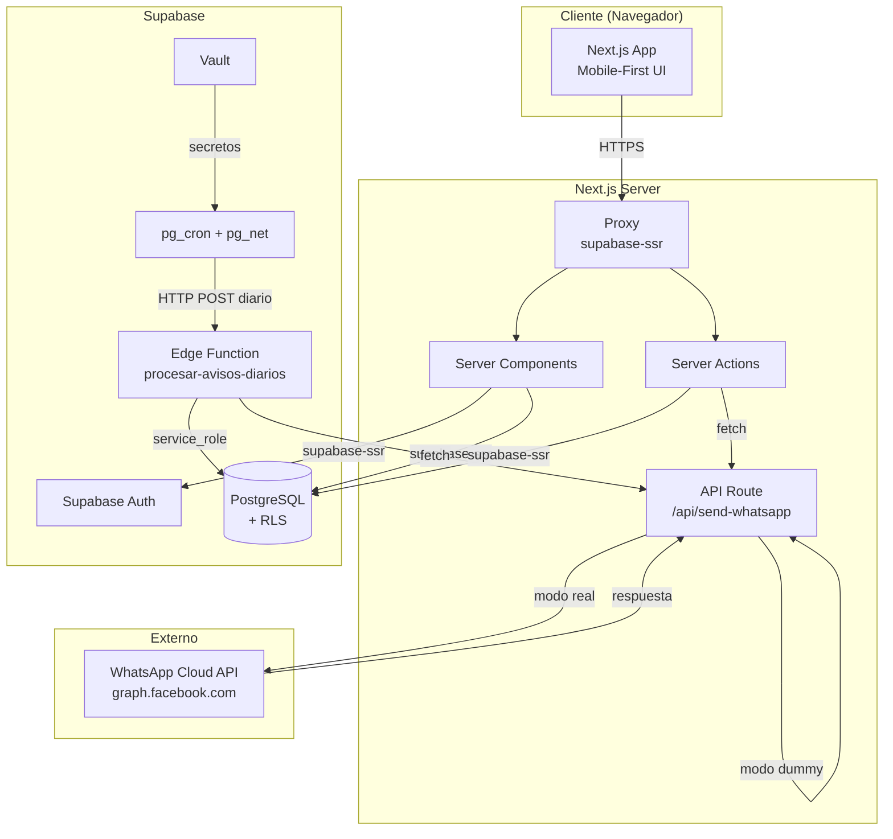
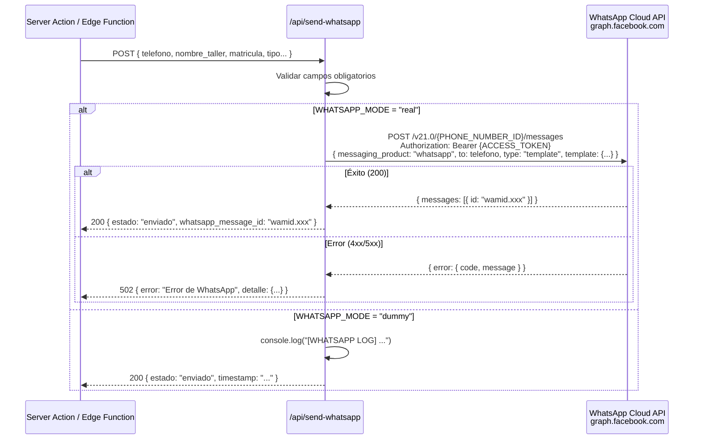
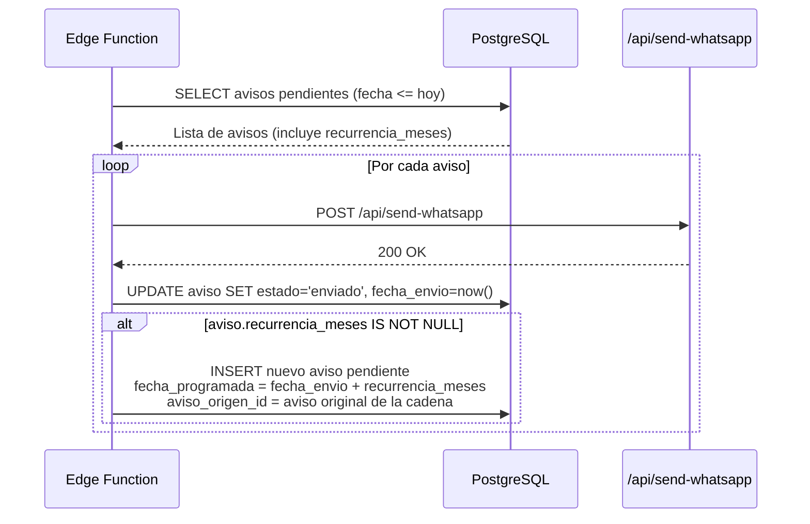
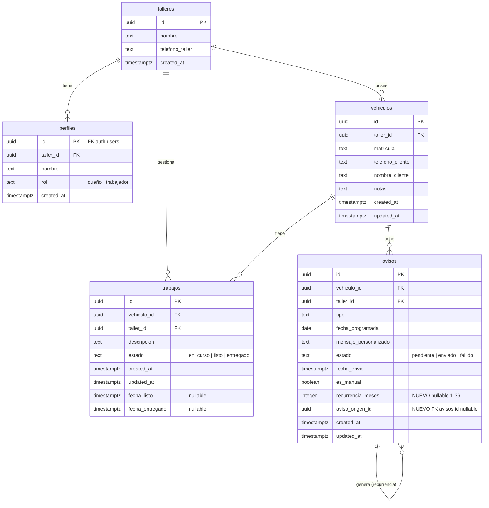

# Documento de Diseño — AutoAvisa Pro

## Visión General

AutoAvisa Pro es un conjunto de mejoras incrementales sobre el MVP existente de AutoAvisa. El objetivo es transformar la aplicación en un producto de pago viable para talleres de reparación. Las mejoras se construyen **sobre** la base existente sin rediseñar funcionalidades ya implementadas.

### Mejoras Principales

| Mejora | Descripción |
|---|---|
| WhatsApp Cloud API | Integración real con la API de Meta para envío de mensajes (modo dual: dummy/real) |
| Avisos Recurrentes | Reprogramación automática de avisos periódicos (aceite cada 6 meses, ITV cada 12, etc.) |
| Vista del Día | Dashboard accionable con avisos de hoy, atrasados y próximos 7 días + acciones rápidas |
| Edición Completa | CRUD completo para vehículos y avisos (actualmente solo crear/eliminar) |
| Trabajos Listo | Registro de reparaciones en curso con notificación WhatsApp instantánea al completar |

### Stack Tecnológico (sin cambios)

- **Frontend**: Next.js 16 con App Router, Tailwind CSS v4, Lucide React
- **Backend**: Supabase (Auth, PostgreSQL con RLS, Edge Functions)
- **Testing**: Vitest + fast-check (PBT)
- **WhatsApp**: Modo dual — dummy (console.log) o real (WhatsApp Cloud API de Meta)

### Decisiones de Diseño Clave

| Decisión | Justificación |
|---|---|
| WhatsApp Cloud API directo (sin SDK) | Llamadas HTTP simples a `graph.facebook.com/v21.0`. No se necesita SDK — solo un POST con Bearer token |
| Plantillas WhatsApp pre-aprobadas | Meta requiere plantillas para mensajes business-initiated. Se usa una plantilla de tipo "utility" con parámetros dinámicos |
| Número WhatsApp compartido | Un solo número Business gestionado por el admin de AutoAvisa. El nombre del taller va en el cuerpo del mensaje |
| Recurrencia en columnas de `avisos` | Dos columnas nuevas (`recurrencia_meses`, `aviso_origen_id`) en vez de tabla separada. Más simple, menos JOINs |
| Migración incremental (ALTER TABLE) | No se recrean tablas. Se añaden columnas y se crea la tabla `trabajos` nueva |
| Reutilización de formularios | Los formularios de edición reutilizan los componentes existentes con datos pre-rellenados |
| Acciones rápidas con Server Actions | "Enviar ahora", "Posponer", "Marcar hecho" usan Server Actions + `revalidatePath` para actualizar sin recarga completa |

## Arquitectura

### Diagrama de Arquitectura Actualizada



### Cambios vs MVP

| Componente | Estado | Descripción del cambio |
|---|---|---|
| `lib/whatsapp.ts` | **Modificado** | `enviarWhatsApp()` ahora selecciona entre modo dummy y modo real según `WHATSAPP_MODE` |
| `/api/send-whatsapp` | **Modificado** | Maneja respuestas de error de la Cloud API (502, rate limit) |
| Edge Function `procesar-avisos-diarios` | **Modificado** | Tras enviar un aviso recurrente, crea el siguiente aviso automáticamente |
| `app/(protected)/dashboard/page.tsx` | **Modificado** | Reemplaza contenido por Vista del Día + sección Trabajos en Curso |
| `app/(protected)/vehiculos/[id]/page.tsx` | **Modificado** | Añade botones de edición, sección Trabajos, indicador de recurrencia |
| `app/(protected)/vehiculos/[id]/avisos/nuevo/page.tsx` | **Modificado** | Añade selector de recurrencia al formulario |
| `types/database.ts` | **Modificado** | Nuevos campos en `Aviso`, nueva interfaz `Trabajo`, nuevo tipo `EstadoTrabajo` |
| `.env.local.example` | **Modificado** | Nuevas variables de WhatsApp Cloud API |
| `supabase/migrations/002_pro.sql` | **Nuevo** | Migración incremental: columnas en avisos + tabla trabajos |
| `app/(protected)/vehiculos/[id]/editar/page.tsx` | **Nuevo** | Página de edición de vehículo |
| `app/(protected)/vehiculos/[id]/avisos/[avisoId]/editar/page.tsx` | **Nuevo** | Página de edición de aviso |
| `app/(protected)/vehiculos/[id]/trabajos/` | **Nuevo** | Acciones y componentes para gestión de trabajos |
| `components/vista-del-dia.tsx` | **Nuevo** | Componente client de la Vista del Día con acciones rápidas |
| `components/selector-recurrencia.tsx` | **Nuevo** | Selector de recurrencia para formularios de avisos |
| `components/trabajo-card.tsx` | **Nuevo** | Tarjeta de trabajo en curso/completado |

### Flujo de Envío WhatsApp (Modo Real)



### Flujo de Recurrencia en el Cron



## Componentes e Interfaces

### Estructura de Carpetas (cambios respecto al MVP)

```
autoavisa-mvp/
├── .env.local.example                          # MODIFICADO: nuevas variables WhatsApp
├── proxy.ts                                    # Sin cambios
├── lib/
│   ├── supabase/                               # Sin cambios
│   └── whatsapp.ts                             # MODIFICADO: modo dual dummy/real
├── types/
│   └── database.ts                             # MODIFICADO: nuevos tipos
├── app/
│   ├── (protected)/
│   │   ├── layout.tsx                          # Sin cambios
│   │   ├── header.tsx                          # Sin cambios
│   │   ├── actions.ts                          # Sin cambios
│   │   ├── dashboard/
│   │   │   └── page.tsx                        # MODIFICADO: Vista del Día + Trabajos
│   │   └── vehiculos/
│   │       ├── actions.ts                      # MODIFICADO: añadir editarVehiculo()
│   │       ├── nuevo/
│   │       │   └── page.tsx                    # Sin cambios
│   │       └── [id]/
│   │           ├── page.tsx                    # MODIFICADO: edición, trabajos, recurrencia
│   │           ├── editar/
│   │           │   └── page.tsx                # NUEVO: formulario edición vehículo
│   │           ├── avisos/
│   │           │   ├── actions.ts              # MODIFICADO: añadir editarAviso()
│   │           │   ├── nuevo/
│   │           │   │   └── page.tsx            # MODIFICADO: selector recurrencia
│   │           │   └── [avisoId]/
│   │           │       └── editar/
│   │           │           └── page.tsx        # NUEVO: formulario edición aviso
│   │           ├── trabajos/
│   │           │   └── actions.ts              # NUEVO: crearTrabajo, marcarListo, marcarEntregado
│   │           └── enviar-aviso/               # Sin cambios
│   └── api/
│       └── send-whatsapp/
│           └── route.ts                        # MODIFICADO: modo dual
├── components/
│   ├── aviso-card.tsx                          # MODIFICADO: indicador recurrencia 🔁
│   ├── vista-del-dia.tsx                       # NUEVO: Vista del Día con acciones rápidas
│   ├── selector-recurrencia.tsx                # NUEVO: selector de recurrencia
│   ├── trabajo-card.tsx                        # NUEVO: tarjeta de trabajo
│   ├── formulario-vehiculo.tsx                 # NUEVO: formulario reutilizable (crear/editar)
│   ├── formulario-aviso.tsx                    # NUEVO: formulario reutilizable (crear/editar)
│   └── ...                                     # Resto sin cambios
├── supabase/
│   ├── migrations/
│   │   ├── 001_schema_inicial.sql              # Sin cambios
│   │   └── 002_pro.sql                         # NUEVO: migración incremental
│   └── functions/
│       └── procesar-avisos-diarios/
│           └── index.ts                        # MODIFICADO: lógica de recurrencia
└── __tests__/
    └── pbt/
        ├── ...                                 # Tests existentes sin cambios
        ├── recurrencia-avisos.test.ts           # NUEVO
        ├── modo-whatsapp.test.ts                # NUEVO
        ├── vista-del-dia-secciones.test.ts      # NUEVO
        ├── validacion-recurrencia.test.ts       # NUEVO
        ├── transiciones-trabajo.test.ts         # NUEVO
        └── edicion-vehiculo.test.ts             # NUEVO
```

### Componentes Nuevos

#### `components/vista-del-dia.tsx` (Client Component)

Componente principal de la Vista del Día. Recibe datos del Server Component del dashboard y renderiza las tres secciones con acciones rápidas.

```typescript
interface VistaDiaProps {
    avisosHoy: AvisoConVehiculo[]
    avisosAtrasados: AvisoConVehiculo[]
    avisosProximos: AvisoConVehiculo[]
    trabajosEnCurso: TrabajoConVehiculo[]
}

interface AvisoConVehiculo {
    id: string
    tipo: TipoAviso
    fecha_programada: string
    vehiculo_id: string
    matricula: string
    nombre_cliente: string | null
    recurrencia_meses: number | null
}

interface TrabajoConVehiculo {
    id: string
    descripcion: string
    vehiculo_id: string
    matricula: string
    nombre_cliente: string | null
    created_at: string
}
```

**Acciones rápidas** (cada una es un Server Action):
- **Enviar ahora**: Llama a `/api/send-whatsapp`, actualiza estado a "enviado"
- **Posponer 1 día**: Actualiza `fecha_programada` a hoy + 1 día
- **Marcar como hecho**: Cambia estado a "enviado" sin enviar WhatsApp, registra `fecha_envio`

#### `components/selector-recurrencia.tsx` (Client Component)

Selector de recurrencia para formularios de avisos. Opciones: "Una vez", "Cada 3 meses", "Cada 6 meses", "Cada 12 meses", "Personalizado".

```typescript
interface SelectorRecurrenciaProps {
    valor: number | null  // null = una vez
    onChange: (meses: number | null) => void
    error?: string
}
```

Cuando se selecciona "Personalizado", muestra un campo numérico (1-36 meses).

#### `components/trabajo-card.tsx` (Client Component)

Tarjeta de trabajo con botón de acción según estado.

```typescript
interface TrabajoCardProps {
    id: string
    descripcion: string
    estado: EstadoTrabajo
    matricula: string
    nombre_cliente: string | null
    created_at: string
    fecha_listo: string | null
    vehiculoId: string
}
```

- Estado `en_curso`: muestra botón grande "Listo ✅"
- Estado `listo`: muestra botón "Entregado 🤝"
- Estado `entregado`: solo información (historial)

#### `components/formulario-vehiculo.tsx` (Client Component)

Formulario reutilizable para crear y editar vehículos. Acepta datos iniciales opcionales para modo edición.

```typescript
interface FormularioVehiculoProps {
    vehiculoId?: string           // Si existe, modo edición
    datosIniciales?: {
        matricula: string
        telefono_cliente: string
        nombre_cliente: string | null
        notas: string | null
    }
    action: (formData: FormData) => Promise<ResultadoAccion>
}
```

#### `components/formulario-aviso.tsx` (Client Component)

Formulario reutilizable para crear y editar avisos. Incluye el selector de recurrencia.

```typescript
interface FormularioAvisoProps {
    vehiculoId: string
    avisoId?: string              // Si existe, modo edición
    datosIniciales?: {
        tipo: TipoAviso
        fecha_programada: string
        mensaje_personalizado: string | null
        recurrencia_meses: number | null
    }
    action: (formData: FormData) => Promise<ResultadoAccion>
}
```

### Componentes Modificados

#### `components/aviso-card.tsx`

Se añade prop `recurrencia_meses` para mostrar el indicador 🔁 junto al tipo cuando el aviso tiene recurrencia configurada.

```typescript
interface AvisoCardProps {
    // ... props existentes
    recurrencia_meses?: number | null  // NUEVO
}
```

### Páginas Nuevas

#### `app/(protected)/vehiculos/[id]/editar/page.tsx`

Server Component que carga los datos actuales del vehículo y renderiza `FormularioVehiculo` en modo edición. Usa `editarVehiculo` Server Action.

#### `app/(protected)/vehiculos/[id]/avisos/[avisoId]/editar/page.tsx`

Server Component que carga los datos actuales del aviso (incluyendo recurrencia) y renderiza `FormularioAviso` en modo edición. Usa `editarAviso` Server Action. Solo accesible para avisos con estado "pendiente".

### Server Actions Nuevas/Modificadas

#### `app/(protected)/vehiculos/actions.ts` — `editarVehiculo()`

```typescript
export async function editarVehiculo(formData: FormData): Promise<ResultadoAccion> {
    // 1. Extraer y validar campos (mismas reglas que crearVehiculo)
    // 2. Verificar que la matrícula no esté duplicada en el taller (excluyendo el vehículo actual)
    // 3. UPDATE vehiculos SET ... WHERE id = vehiculoId
    // 4. revalidatePath
}
```

#### `app/(protected)/vehiculos/[id]/avisos/actions.ts` — `editarAviso()`

```typescript
export async function editarAviso(formData: FormData): Promise<ResultadoAccion> {
    // 1. Extraer y validar campos (tipo, fecha, mensaje, recurrencia_meses)
    // 2. Validar fecha >= hoy
    // 3. Validar recurrencia_meses entre 1-36 si no es null
    // 4. Verificar que el aviso esté en estado "pendiente"
    // 5. UPDATE avisos SET ... WHERE id = avisoId
    // 6. revalidatePath
}
```

#### `app/(protected)/vehiculos/[id]/trabajos/actions.ts` (Nuevo)

```typescript
export async function crearTrabajo(formData: FormData): Promise<ResultadoAccion> {
    // 1. Validar descripción obligatoria
    // 2. INSERT en trabajos con estado='en_curso'
    // 3. revalidatePath
}

export async function marcarTrabajoListo(trabajoId: string, vehiculoId: string): Promise<ResultadoAccion> {
    // 1. UPDATE trabajo SET estado='listo', fecha_listo=now()
    // 2. Obtener datos del vehículo y taller
    // 3. Generar mensaje de "trabajo listo"
    // 4. POST a /api/send-whatsapp
    // 5. Si WhatsApp falla: trabajo sigue como "listo" pero se muestra advertencia
    // 6. revalidatePath
}

export async function marcarTrabajoEntregado(trabajoId: string, vehiculoId: string): Promise<ResultadoAccion> {
    // 1. UPDATE trabajo SET estado='entregado', fecha_entregado=now()
    // 2. revalidatePath
}
```

#### Acciones rápidas de la Vista del Día (en `app/(protected)/actions.ts` o archivo dedicado)

```typescript
export async function enviarAvisoAhora(avisoId: string): Promise<ResultadoAccion> {
    // 1. Obtener aviso con datos de vehículo y taller
    // 2. POST a /api/send-whatsapp
    // 3. UPDATE aviso SET estado='enviado', fecha_envio=now()
    // 4. Si recurrencia_meses != null: crear siguiente aviso
    // 5. revalidatePath('/dashboard')
}

export async function posponerAviso(avisoId: string): Promise<ResultadoAccion> {
    // 1. Calcular nueva fecha = hoy + 1 día
    // 2. UPDATE aviso SET fecha_programada = nueva_fecha
    // 3. revalidatePath('/dashboard')
}

export async function marcarAvisoHecho(avisoId: string): Promise<ResultadoAccion> {
    // 1. UPDATE aviso SET estado='enviado', fecha_envio=now()
    // 2. Si recurrencia_meses != null: crear siguiente aviso
    // 3. revalidatePath('/dashboard')
}
```

### Modificación de `lib/whatsapp.ts`

La función `enviarWhatsApp()` se modifica para soportar modo dual:

```typescript
export async function enviarWhatsApp(params: {
    telefono: string
    nombre_cliente: string
    nombre_taller: string
    tipo_mantenimiento: TipoAviso
    mensaje: string
    matricula: string
}): Promise<{ estado: 'enviado'; timestamp: string; whatsapp_message_id?: string }> {
    const modo = process.env.WHATSAPP_MODE ?? 'dummy'

    if (modo === 'real') {
        return enviarWhatsAppReal(params)
    }

    return enviarWhatsAppDummy(params)
}
```

#### `enviarWhatsAppReal()` — Integración con WhatsApp Cloud API

```typescript
async function enviarWhatsAppReal(params: { ... }): Promise<...> {
    const accessToken = process.env.WHATSAPP_ACCESS_TOKEN
    const phoneNumberId = process.env.WHATSAPP_PHONE_NUMBER_ID
    const templateName = process.env.WHATSAPP_TEMPLATE_NAME ?? 'aviso_mantenimiento'

    if (!accessToken || !phoneNumberId) {
        throw new Error('Variables WHATSAPP_ACCESS_TOKEN y WHATSAPP_PHONE_NUMBER_ID requeridas para modo real')
    }

    // Formatear teléfono: quitar el "+" para la API de Meta
    const telefonoSinPlus = params.telefono.replace(/^\+/, '')

    const response = await fetch(
        `https://graph.facebook.com/v21.0/${phoneNumberId}/messages`,
        {
            method: 'POST',
            headers: {
                'Authorization': `Bearer ${accessToken}`,
                'Content-Type': 'application/json',
            },
            body: JSON.stringify({
                messaging_product: 'whatsapp',
                to: telefonoSinPlus,
                type: 'template',
                template: {
                    name: templateName,
                    language: { code: 'es' },
                    components: [
                        {
                            type: 'body',
                            parameters: [
                                { type: 'text', text: params.nombre_taller },
                                { type: 'text', text: params.matricula },
                                { type: 'text', text: ETIQUETA_TIPO[params.tipo_mantenimiento] ?? params.tipo_mantenimiento },
                            ],
                        },
                    ],
                },
            }),
        }
    )

    if (!response.ok) {
        const errorBody = await response.json()
        throw new WhatsAppApiError(
            errorBody.error?.message ?? 'Error desconocido de WhatsApp',
            response.status,
            errorBody.error?.code
        )
    }

    const data = await response.json()
    return {
        estado: 'enviado',
        timestamp: new Date().toISOString(),
        whatsapp_message_id: data.messages?.[0]?.id,
    }
}
```

#### Clase de error personalizada

```typescript
export class WhatsAppApiError extends Error {
    constructor(
        message: string,
        public httpStatus: number,
        public whatsappCode?: number
    ) {
        super(message)
        this.name = 'WhatsAppApiError'
    }

    get esRateLimit(): boolean {
        return this.httpStatus === 429 || this.whatsappCode === 130429
    }
}
```

### Modificación de `/api/send-whatsapp/route.ts`

Se actualiza para manejar errores de la Cloud API:

```typescript
export async function POST(request: Request) {
    try {
        // ... validaciones existentes ...

        const resultado = await enviarWhatsApp({ ... })
        return Response.json(resultado, { status: 200 })
    } catch (error) {
        if (error instanceof WhatsAppApiError) {
            console.error(`[ERROR WHATSAPP] HTTP ${error.httpStatus}: ${error.message}`)
            return Response.json(
                { error: 'Error de WhatsApp', detalle: error.message, codigo: error.whatsappCode },
                { status: 502 }
            )
        }
        return Response.json({ error: 'Error interno del servidor' }, { status: 500 })
    }
}
```

### Modificación de la Edge Function `procesar-avisos-diarios`

Se añade lógica de recurrencia tras enviar cada aviso:

```typescript
// Después de UPDATE aviso SET estado='enviado':
if (aviso.recurrencia_meses != null && aviso.recurrencia_meses > 0) {
    const fechaEnvio = new Date()
    const siguienteFecha = new Date(fechaEnvio)
    siguienteFecha.setMonth(siguienteFecha.getMonth() + aviso.recurrencia_meses)
    const siguienteFechaISO = siguienteFecha.toISOString().split('T')[0]

    // Determinar aviso_origen_id: si este aviso ya tiene uno, usar ese; si no, usar su propio id
    const origenId = aviso.aviso_origen_id ?? aviso.id

    const { error: errorRecurrencia } = await supabase
        .from('avisos')
        .insert({
            vehiculo_id: aviso.vehiculo_id,
            tipo: aviso.tipo,
            fecha_programada: siguienteFechaISO,
            mensaje_personalizado: aviso.mensaje_personalizado,
            estado: 'pendiente',
            es_manual: false,
            recurrencia_meses: aviso.recurrencia_meses,
            aviso_origen_id: origenId,
        })

    if (errorRecurrencia) {
        console.error(`[ERROR] No se pudo crear siguiente aviso recurrente para ${aviso.id}: ${errorRecurrencia.message}`)
    } else {
        console.log(`[OK] Creado siguiente aviso recurrente para ${aviso.id} → ${siguienteFechaISO}`)
    }
}
```

**Nota importante sobre la Edge Function**: La Edge Function usa `service_role` key que bypasea RLS. El trigger `asignar_taller_aviso` se ejecuta igualmente en el INSERT y asigna `taller_id` automáticamente desde el `vehiculo_id`.


## Modelos de Datos

### Diagrama Entidad-Relación Actualizado



### Migración SQL Incremental (`supabase/migrations/002_pro.sql`)

#### Nuevas columnas en tabla `avisos`

```sql
-- Columna para intervalo de recurrencia en meses (null = aviso de una sola vez)
ALTER TABLE public.avisos
  ADD COLUMN recurrencia_meses INTEGER;

-- Constraint: recurrencia entre 1 y 36 meses (o null)
ALTER TABLE public.avisos
  ADD CONSTRAINT chk_recurrencia_meses
  CHECK (recurrencia_meses IS NULL OR (recurrencia_meses >= 1 AND recurrencia_meses <= 36));

-- Columna para rastrear la cadena de recurrencia (referencia al aviso original)
ALTER TABLE public.avisos
  ADD COLUMN aviso_origen_id UUID REFERENCES public.avisos(id) ON DELETE SET NULL;

-- Índice para consultas de cadenas de recurrencia
CREATE INDEX idx_avisos_origen ON public.avisos(aviso_origen_id)
  WHERE aviso_origen_id IS NOT NULL;
```

#### Nueva tabla `trabajos`

```sql
-- Tabla de trabajos/reparaciones en curso
CREATE TABLE public.trabajos (
  id UUID PRIMARY KEY DEFAULT gen_random_uuid(),
  vehiculo_id UUID NOT NULL REFERENCES public.vehiculos(id) ON DELETE CASCADE,
  taller_id UUID NOT NULL REFERENCES public.talleres(id) ON DELETE CASCADE,
  descripcion TEXT NOT NULL,
  estado TEXT NOT NULL DEFAULT 'en_curso'
    CHECK (estado IN ('en_curso', 'listo', 'entregado')),
  created_at TIMESTAMPTZ NOT NULL DEFAULT now(),
  updated_at TIMESTAMPTZ NOT NULL DEFAULT now(),
  fecha_listo TIMESTAMPTZ,
  fecha_entregado TIMESTAMPTZ
);

-- Habilitar RLS
ALTER TABLE public.trabajos ENABLE ROW LEVEL SECURITY;

-- Índices
CREATE INDEX idx_trabajos_vehiculo_id ON public.trabajos(vehiculo_id);
CREATE INDEX idx_trabajos_taller_id ON public.trabajos(taller_id);
CREATE INDEX idx_trabajos_estado ON public.trabajos(taller_id, estado)
  WHERE estado = 'en_curso';
```

#### Políticas RLS para `trabajos`

```sql
-- SELECT: solo trabajos de su taller
CREATE POLICY "Usuarios ven trabajos de su taller"
  ON public.trabajos FOR SELECT
  USING (taller_id = public.get_mi_taller_id());

-- INSERT: solo pueden insertar trabajos en su taller
CREATE POLICY "Usuarios crean trabajos en su taller"
  ON public.trabajos FOR INSERT
  WITH CHECK (taller_id = public.get_mi_taller_id());

-- UPDATE: solo pueden actualizar trabajos de su taller
CREATE POLICY "Usuarios actualizan trabajos de su taller"
  ON public.trabajos FOR UPDATE
  USING (taller_id = public.get_mi_taller_id())
  WITH CHECK (taller_id = public.get_mi_taller_id());

-- DELETE: solo pueden eliminar trabajos de su taller
CREATE POLICY "Usuarios eliminan trabajos de su taller"
  ON public.trabajos FOR DELETE
  USING (taller_id = public.get_mi_taller_id());
```

#### Triggers para `trabajos`

```sql
-- Trigger: actualizar updated_at automáticamente
CREATE TRIGGER trigger_trabajos_updated_at
  BEFORE UPDATE ON public.trabajos
  FOR EACH ROW
  EXECUTE FUNCTION public.actualizar_updated_at();

-- Trigger: asignar taller_id automáticamente desde el vehículo
-- Reutiliza el mismo patrón que asignar_taller_aviso
CREATE OR REPLACE FUNCTION public.asignar_taller_trabajo()
RETURNS TRIGGER
LANGUAGE plpgsql
SECURITY DEFINER
SET search_path = ''
AS $
BEGIN
  SELECT taller_id INTO NEW.taller_id
  FROM public.vehiculos
  WHERE id = NEW.vehiculo_id;

  IF NEW.taller_id IS NULL THEN
    RAISE EXCEPTION 'Vehículo no encontrado';
  END IF;

  RETURN NEW;
END;
$;

CREATE TRIGGER trigger_asignar_taller_trabajo
  BEFORE INSERT ON public.trabajos
  FOR EACH ROW
  EXECUTE FUNCTION public.asignar_taller_trabajo();
```

### Tipos TypeScript Actualizados (`types/database.ts`)

```typescript
// Nuevos tipos
export type EstadoTrabajo = 'en_curso' | 'listo' | 'entregado'

// Interfaz Aviso actualizada (campos nuevos)
export interface Aviso {
    // ... campos existentes ...
    recurrencia_meses: number | null    // NUEVO
    aviso_origen_id: string | null      // NUEVO
}

// Nueva interfaz
export interface Trabajo {
    id: string
    vehiculo_id: string
    taller_id: string
    descripcion: string
    estado: EstadoTrabajo
    created_at: string
    updated_at: string
    fecha_listo: string | null
    fecha_entregado: string | null
}
```

### Variables de Entorno (`.env.local.example` actualizado)

```bash
# --- Supabase (existentes) ---
NEXT_PUBLIC_SUPABASE_URL=tu-url-de-supabase
NEXT_PUBLIC_SUPABASE_ANON_KEY=tu-clave-anonima
SUPABASE_SERVICE_ROLE_KEY=tu-clave-service-role
ADMIN_SECRET=tu-contraseña-de-admin

# --- WhatsApp Cloud API (nuevas) ---

# Modo de envío de WhatsApp: "dummy" (log en consola) o "real" (WhatsApp Cloud API)
# Si no se configura, se usa "dummy" por defecto
WHATSAPP_MODE=dummy

# Token de acceso permanente de la WhatsApp Cloud API de Meta
# Obtener en: https://developers.facebook.com → Tu App → WhatsApp → Configuración de la API
WHATSAPP_ACCESS_TOKEN=tu-access-token

# ID del número de teléfono de WhatsApp Business
# Obtener en: https://developers.facebook.com → Tu App → WhatsApp → Configuración de la API
WHATSAPP_PHONE_NUMBER_ID=tu-phone-number-id

# Nombre de la plantilla de WhatsApp aprobada por Meta
# La plantilla debe tener 3 parámetros: {{1}} nombre_taller, {{2}} matrícula, {{3}} tipo_mantenimiento
WHATSAPP_TEMPLATE_NAME=aviso_mantenimiento
```


## Propiedades de Corrección

*Una propiedad es una característica o comportamiento que debe cumplirse en todas las ejecuciones válidas de un sistema — esencialmente, una declaración formal sobre lo que el sistema debe hacer. Las propiedades sirven como puente entre especificaciones legibles por humanos y garantías de corrección verificables por máquinas.*

### Reflexión sobre Propiedades

Tras el análisis de prework, se identificaron las siguientes consolidaciones para eliminar redundancia:

- **1.1 + 1.3 + 7.2** → Una sola propiedad de selección de modo (dummy es el default, solo "real" activa Cloud API)
- **1.4 + 1.6** → Una sola propiedad de construcción del payload (incluye nombre_taller como parámetro)
- **1.7 + 1.8** → Una sola propiedad de manejo de errores (rate limit es un caso del manejo general)
- **2.4 + 2.5** → Una sola propiedad de cadena de recurrencia (crear siguiente aviso incluye asignar aviso_origen_id)
- **3.1 + 3.2 + 3.3 + 3.4** → Una sola propiedad de clasificación de avisos en secciones
- **3.6 + 3.8** → Una sola propiedad de transición de estado por acciones rápidas
- **8.3 + 8.5 + 8.7 + 8.9** → Una sola propiedad de máquina de estados de trabajos
- **2.6** (indicador 🔁) → Mejor como test de ejemplo (UI rendering)
- **5.4** (fecha >= hoy en edición) → Cubierto por tests existentes del MVP

### Propiedad 1: Selección de modo WhatsApp

*Para cualquier* valor de la variable de entorno `WHATSAPP_MODE` (incluyendo undefined, vacío, o valores arbitrarios), la función `enviarWhatsApp()` SHALL utilizar el modo "real" (WhatsApp Cloud API) únicamente cuando el valor sea exactamente `"real"`, y SHALL utilizar el modo "dummy" (log en consola) en todos los demás casos.

**Valida: Requisitos 1.1, 1.3, 7.2**

### Propiedad 2: Construcción del payload de plantilla WhatsApp

*Para cualquier* combinación válida de datos de aviso (nombre_taller, matrícula, tipo_mantenimiento), el payload construido para la WhatsApp Cloud API SHALL contener: `messaging_product: "whatsapp"`, `type: "template"`, el nombre de plantilla configurado, idioma `"es"`, y exactamente 3 parámetros de cuerpo en orden: nombre_taller, matrícula y etiqueta del tipo de mantenimiento.

**Valida: Requisitos 1.4, 1.6**

### Propiedad 3: Manejo de errores de la WhatsApp Cloud API

*Para cualquier* respuesta de error de la WhatsApp Cloud API (incluyendo errores 4xx, 5xx y rate limit 429), la API `/api/send-whatsapp` SHALL retornar un código HTTP 502 con el detalle del error, y SHALL no modificar el estado del aviso (permanece "pendiente").

**Valida: Requisitos 1.7, 1.8**

### Propiedad 4: Generación de siguiente aviso en cadena recurrente

*Para cualquier* aviso con `recurrencia_meses` configurado (1-36) que cambia a estado "enviado", el sistema SHALL crear un nuevo aviso con: estado "pendiente", mismo `tipo`, mismo `vehiculo_id`, misma `recurrencia_meses`, `fecha_programada` igual a la fecha de envío real + `recurrencia_meses` meses, y `aviso_origen_id` apuntando al primer aviso de la cadena (el aviso original, no el inmediatamente anterior).

**Valida: Requisitos 2.4, 2.5**

### Propiedad 5: Validación de intervalo de recurrencia

*Para cualquier* valor numérico, la validación de `recurrencia_meses` SHALL aceptar únicamente enteros positivos entre 1 y 36 (inclusive) o null, y SHALL rechazar todos los demás valores (negativos, cero, mayores a 36, decimales).

**Valida: Requisito 2.9**

### Propiedad 6: Clasificación de avisos en secciones de la Vista del Día

*Para cualquier* conjunto de avisos pendientes con distintas fechas programadas y una fecha "hoy" dada, la función de clasificación SHALL asignar cada aviso exactamente a una sección: "Hoy" (fecha_programada = hoy), "Atrasados" (fecha_programada < hoy), o "Próximos 7 Días" (fecha_programada entre mañana y hoy+7 días). Los avisos con fecha_programada > hoy+7 días no SHALL aparecer en ninguna sección. Los avisos con estado distinto de "pendiente" no SHALL aparecer en ninguna sección.

**Valida: Requisitos 3.1, 3.2, 3.3, 3.4**

### Propiedad 7: Acción rápida "Posponer 1 día"

*Para cualquier* aviso pendiente y cualquier fecha "hoy", tras ejecutar la acción "Posponer 1 día", la `fecha_programada` del aviso SHALL ser igual a hoy + 1 día calendario, independientemente de cuál fuera la fecha_programada original.

**Valida: Requisito 3.7**

### Propiedad 8: Acciones rápidas de estado en Vista del Día

*Para cualquier* aviso pendiente, tanto la acción "Enviar ahora" como "Marcar como hecho" SHALL cambiar el estado a "enviado" y SHALL asignar `fecha_envio` con la fecha/hora actual. Además, si el aviso tiene `recurrencia_meses` configurado, ambas acciones SHALL generar el siguiente aviso de la cadena recurrente.

**Valida: Requisitos 3.6, 3.8**

### Propiedad 9: Restricción de edición a avisos pendientes

*Para cualquier* aviso con estado distinto de "pendiente" (es decir, "enviado" o "fallido"), un intento de edición SHALL ser rechazado con un error, sin modificar el registro.

**Valida: Requisito 5.5**

### Propiedad 10: Máquina de estados de trabajos

*Para cualquier* trabajo, las transiciones de estado válidas SHALL ser únicamente: `en_curso` → `listo` → `entregado`. Al crear un trabajo, su estado inicial SHALL ser "en_curso". Al transicionar a "listo", `fecha_listo` SHALL ser asignada. Al transicionar a "entregado", `fecha_entregado` SHALL ser asignada. Transiciones inválidas (ej: en_curso → entregado, listo → en_curso) SHALL ser rechazadas.

**Valida: Requisitos 8.3, 8.5, 8.9**

### Propiedad 11: Trabajo listo independiente de WhatsApp

*Para cualquier* trabajo en estado "en_curso", al ejecutar la acción "Marcar como listo", el estado SHALL cambiar a "listo" y `fecha_listo` SHALL ser asignada, independientemente de si el envío de WhatsApp fue exitoso o falló.

**Valida: Requisitos 8.5, 8.7**

### Propiedad 12: Orden descendente del historial de trabajos

*Para cualquier* vehículo con múltiples trabajos completados (estado "listo" o "entregado"), el historial SHALL mostrar los trabajos ordenados por `fecha_listo` de forma descendente (más recientes primero).

**Valida: Requisito 8.12**

### Propiedad 13: Validación de variables de entorno en modo real

*Para cualquier* combinación de variables de entorno donde `WHATSAPP_MODE` sea "real", si `WHATSAPP_ACCESS_TOKEN` o `WHATSAPP_PHONE_NUMBER_ID` no están configuradas (undefined o vacías), la función `enviarWhatsApp()` SHALL lanzar un error descriptivo indicando qué variables faltan.

**Valida: Requisito 7.3**

## Manejo de Errores

### Errores de WhatsApp Cloud API (Nuevos)

| Escenario | Comportamiento | Respuesta HTTP |
|---|---|---|
| Cloud API retorna error genérico (4xx/5xx) | Log del error, aviso permanece "pendiente" | 502 `{ error: "Error de WhatsApp", detalle: "..." }` |
| Cloud API retorna rate limit (429) | Log del error, aviso permanece "pendiente" para reintento en siguiente cron | 502 `{ error: "Error de WhatsApp", detalle: "Rate limit" }` |
| Variables de entorno faltantes en modo "real" | Lanzar error descriptivo | 500 `{ error: "Variables WHATSAPP_ACCESS_TOKEN y WHATSAPP_PHONE_NUMBER_ID requeridas" }` |
| Token de acceso expirado | Cloud API retorna 401, se trata como error genérico | 502 `{ error: "Error de WhatsApp", detalle: "Token expirado" }` |
| Número de teléfono no registrado en WhatsApp | Cloud API retorna error, aviso permanece "pendiente" | 502 `{ error: "Error de WhatsApp", detalle: "..." }` |

### Errores de Recurrencia (Nuevos)

| Escenario | Comportamiento | Log |
|---|---|---|
| Fallo al crear siguiente aviso recurrente | El aviso original se marca como "enviado" correctamente; se registra error del siguiente | `[ERROR] No se pudo crear siguiente aviso recurrente para {id}` |
| Valor de recurrencia_meses inválido en BD | Constraint CHECK rechaza la inserción | Error de PostgreSQL (constraint violation) |
| Cadena de recurrencia con aviso_origen_id huérfano | ON DELETE SET NULL — el campo se pone a null | Sin impacto funcional |

### Errores de Edición (Nuevos)

| Escenario | Comportamiento | Mensaje al Usuario |
|---|---|---|
| Editar aviso no pendiente | Rechazar operación | "Solo se pueden editar avisos pendientes" |
| Matrícula duplicada al editar vehículo | Rechazar operación | "Esta matrícula ya está registrada en tu taller" |
| Fecha pasada al editar aviso | Rechazar operación | "La fecha del aviso debe ser igual o posterior a hoy" |
| Recurrencia fuera de rango (1-36) | Rechazar operación | "El intervalo de recurrencia debe ser entre 1 y 36 meses" |

### Errores de Trabajos (Nuevos)

| Escenario | Comportamiento | Mensaje al Usuario |
|---|---|---|
| Descripción vacía al crear trabajo | Rechazar operación | "La descripción del trabajo es obligatoria" |
| Marcar como listo un trabajo que no está en_curso | Rechazar operación | "Este trabajo no está en curso" |
| Marcar como entregado un trabajo que no está listo | Rechazar operación | "Este trabajo no está marcado como listo" |
| WhatsApp falla al marcar trabajo como listo | Trabajo cambia a "listo" igualmente | Toast de advertencia: "El trabajo se marcó como listo pero no se pudo enviar el WhatsApp" |

### Errores Existentes (Sin cambios)

Los errores de autenticación, validación general, base de datos y cron del MVP se mantienen sin cambios.

## Estrategia de Testing

### Enfoque Dual: Tests Unitarios + Tests de Propiedades

Se mantiene el enfoque dual del MVP. Los tests nuevos se añaden a la estructura existente en `__tests__/`.

### Librería de Property-Based Testing

- **Librería**: [fast-check](https://github.com/dubzzz/fast-check) (ya instalada, v4.7.0)
- **Runner**: Vitest (ya configurado)
- **Configuración**: Mínimo 100 iteraciones por test de propiedad
- **Etiquetado**: Cada test referencia su propiedad del documento de diseño
- **Formato de tag**: `Feature: autoavisa-pro, Property {número}: {texto}`

### Tests Basados en Propiedades (PBT) — Nuevos

| Propiedad | Archivo de Test | Qué se genera | Qué se verifica |
|---|---|---|---|
| P1: Selección de modo | `modo-whatsapp.test.ts` | Valores aleatorios de WHATSAPP_MODE (strings, undefined, vacío) | Solo "real" activa Cloud API; todo lo demás usa dummy |
| P2: Payload plantilla | `modo-whatsapp.test.ts` | Datos aleatorios de aviso (nombre_taller, matrícula, tipo) | Payload contiene estructura correcta con 3 parámetros |
| P3: Errores Cloud API | `modo-whatsapp.test.ts` | Respuestas de error aleatorias (status codes, mensajes) | Siempre retorna 502, aviso permanece pendiente |
| P4: Cadena recurrente | `recurrencia-avisos.test.ts` | Avisos con recurrencia_meses (1-36), fechas aleatorias | Siguiente aviso creado con fecha correcta, aviso_origen_id correcto |
| P5: Validación recurrencia | `validacion-recurrencia.test.ts` | Enteros aleatorios (negativos, 0, 1-36, >36, decimales) | Solo 1-36 aceptados, resto rechazado |
| P6: Clasificación Vista del Día | `vista-del-dia-secciones.test.ts` | Conjuntos de avisos con fechas y estados aleatorios | Cada aviso en la sección correcta según fecha vs hoy |
| P7: Posponer 1 día | `vista-del-dia-secciones.test.ts` | Avisos con fechas aleatorias | fecha_programada = hoy + 1 tras posponer |
| P8: Acciones rápidas estado | `vista-del-dia-secciones.test.ts` | Avisos pendientes aleatorios (con/sin recurrencia) | Estado cambia a "enviado", fecha_envio asignada, recurrencia genera siguiente |
| P9: Edición solo pendientes | `edicion-avisos.test.ts` | Avisos con estados aleatorios | Solo pendientes editables, resto rechazado |
| P10: Máquina estados trabajos | `transiciones-trabajo.test.ts` | Trabajos con estados y transiciones aleatorias | Solo transiciones válidas aceptadas, timestamps correctos |
| P11: Trabajo listo independiente | `transiciones-trabajo.test.ts` | Trabajos en_curso con WhatsApp mock (éxito/fallo aleatorio) | Estado siempre cambia a "listo" independientemente de WhatsApp |
| P12: Orden historial trabajos | `transiciones-trabajo.test.ts` | Trabajos completados con fechas aleatorias | Ordenados por fecha_listo descendente |
| P13: Validación env vars modo real | `modo-whatsapp.test.ts` | Combinaciones aleatorias de env vars | Error descriptivo si modo=real y faltan tokens |

### Tests Unitarios (Ejemplos y Edge Cases) — Nuevos

| Área | Archivo | Qué se verifica |
|---|---|---|
| Formulario edición vehículo | `edicion-vehiculo.test.ts` | Pre-relleno de campos, validación, cancelación |
| Formulario edición aviso | `edicion-avisos.test.ts` | Pre-relleno con recurrencia, validación fecha |
| Selector recurrencia | `formularios.test.ts` | Opciones correctas, campo personalizado 1-36 |
| Vista del Día vacía | `dashboard.test.ts` | Mensaje de celebración cuando no hay avisos |
| Sección atrasados destacada | `dashboard.test.ts` | CSS de advertencia cuando hay atrasados |
| Trabajo card estados | `trabajos.test.ts` | Botón correcto según estado (Listo/Entregado/historial) |
| WhatsApp dummy log format | `api-whatsapp.test.ts` | Formato de log existente se mantiene en modo dummy |

### Tests de Integración — Nuevos

| Flujo | Archivo | Qué se verifica |
|---|---|---|
| Crear aviso recurrente → cron → siguiente aviso | `flujos.test.ts` | Cadena completa de recurrencia |
| Editar vehículo → verificar datos actualizados | `flujos.test.ts` | CRUD completo de edición |
| Crear trabajo → listo → WhatsApp → entregado | `flujos.test.ts` | Flujo completo de trabajos |

### Tests Smoke — Existentes + Nuevos

| Verificación | Archivo |
|---|---|
| Migración 002_pro.sql existe y contiene ALTER TABLE + CREATE TABLE | `archivos.test.ts` |
| .env.local.example contiene variables de WhatsApp | `archivos.test.ts` |
| types/database.ts contiene Trabajo y campos nuevos de Aviso | `archivos.test.ts` |

